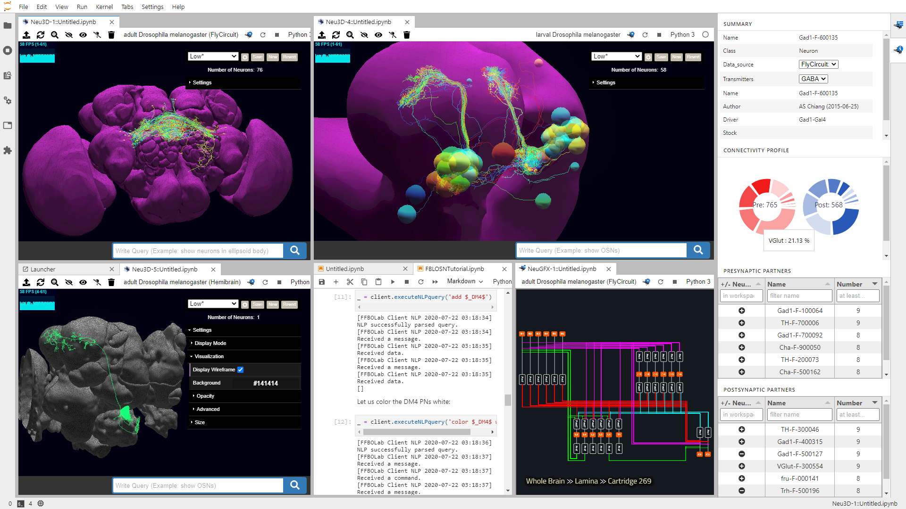

**[Get Started](#get-started)** |
**[Full FlyBrainLab Install](#full)** |
**[Installation JupyterLab 3.x](#jlab3-install)** |
**[Develop JupyterLab 3.x](#jlab3-develop)** |
**[Installation JupyterLab 2.x](#jlab2)** |
**[Develop JupyterLab 2.x](#jlab2-develop)** |
**[Getting help](#getting-help)**

# NeuroMynerva _v2_ - [FlyBrainLab](http://fbl.fruitflybrain.org/)'s JupyterLab Extension
NeuroMynerva V2 is currently in _alpha_, most main user-facing features have been implemented but we expect bug fixes and additional features to be incorporated in the near future. If you want to report a bug, please see [Getting Help](#getting-help). To follow the latest developments on this project, follow the Fruit Fly Brain Observatory(FFBO) [Twitter](https://twitter.com/flybrainobs) where we post weekly updates.

<center></center>

## Get Started

_Note:_ Following JupyterLab 3.0's new extension system, NeuroMynerva is now distributed
on PyPI and can be installed using your python installer.
Please follow installation instruction detailed in [Installation](#installation) section
for details on how to install and/or develop NeuroMynerva.

### Using NeuroMynerva and FlyBrainLab
The best way to get started with NeuroMynerva is to look at the instructions on the [FlyBrainLab's page](https://github.com/FlyBrainLab/FlyBrainLab) and the [Wiki](https://github.com/FlyBrainLab/FlyBrainLab/wiki) therein.

For developers interested in the technical aspects of the NeuroMynerva platform, you can refer to the [NeuroMynerva Wiki](https://github.com/FlyBrainLab/NeuroMynerva/wiki).

### Key Components
NeuroMynerva front-end currently includes 4 key components:
1. `Neu3D-Widget`: A neuron/synapse morphology visualization toolkit that supports 3D rendering of neuron skeletons and meshes.
2. `Info-Widget`: A side panel widget that shows detailed neuron information (metadata, pre-/post- synaptic partners, etc.). Content updated by clicking on individual neurons in `Neu3D-Widget`.
3. `NeuGFX-Widget`: A circuit visualization widget.
4. `Master-Widget`: A side panel widget that keeps track of all currently running NeuroMynerva widgets.

## Installation
### Prerequisites
NeuroMynerva has the following requirements:

- Python Version 3.6+
- JupyterLab >= 2.2.0 or JupyterLab >= 3.0.0
    * JupyterLab 2.x and 3.x have different installation instructions.
    See the sections below ([Jlab 2.x](#jlab2), [Jlab 3.x](#jlab3))
- Packages:
    * [Neuroballad](https://github.com/FlyBrainLab/Neuroballad.git) and packages required therein,
    * [flybrainlab](https://pypi.org/project/flybrainlab/) and packages required therein.

---
### <a id="full"></a> 1. Installation of Full FlyBrainLab Eco-System
Up-to-date installation instructions for the whole FlyBrainLab ecosystem
(NeuroMynerva + FlyBrainLab User-side and Server-side Backends)
are available at https://github.com/FlyBrainLab/FlyBrainLab#readme.

---
### <a id="jlab3"></a> 2. Install/Develop/Uninstall on **JupyterLab 3.x**

#### <a id="jlab3-install"></a> **Installation of NeuroMynerva**
JupyterLab 3.x supports installing NeuroMynerva as a python package.
You can install NeuroMynerva directly from PyPI via command line as
```bash
pip install git+https://github.com/mkturkcan/autobahn-sync.git git+https://github.com/FlyBrainLab/Neuroballad.git git+https://github.com/palash1992/GEM.git git+https://github.com/mkturkcan/nxcontrol # flybrainlab requirements
pip install flybrainlab  # required package for communicating with backend
pip install neuromynerva # and refresh browser afterwards
```
#### <a id="jlab3-develop"></a> **Develop NeuroMynerva**
We use [Anaconda](https://www.anaconda.com/) to manage development environment, you are encouraged to first create a Conda environment

```bash
# create conda environment and install python dependencies
conda create -n fbl python=3.7 nodejs scipy pandas cookiecutter git yarn -c conda-forge -y
conda activate fbl
```


You can then use the following script to setup the development environment.
```bash
# create conda environment and install python dependencies
pip install jupyter jupyterlab>=3
pip install txaio twisted autobahn crochet service_identity autobahn-sync matplotlib h5py seaborn fastcluster networkx msgpack jupyter-packaging

# if on Windows, execute the following:
# pip install pypiwin32

# Install flybrainlab package for communication with backend
pip install flybrainlab

# Alternative, you can download the source code for the inhouse packages as well
# git clone https://github.com/FlyBrainLab/Neuroballad.git
# git clone https://github.com/FlyBrainLab/FBLClient.git
# cd ./Neuroballad
# python setup.py develop
# cd ../FBLClient
# python setup.py develop
```

Next, we build the NeuroMynerva from source.

_Note:_ You will need NodeJS to build the extension package.

The `jlpm` command is JupyterLab's pinned version of
[yarn](https://yarnpkg.com/) that is installed with JupyterLab. You may use
`yarn` or `npm` in lieu of `jlpm` below.
```bash
# assuming currently in FBLClient folder
cd ../  # go back to parent folder on the same level as FBLClient and NeuroBallad

# Clone the repo to your local environment
# Change directory to the neuromynerva directory
git clone https://github.com/FlyBrainLab/NeuroMynerva.git
cd ./NeuroMynerva

# Install package in development mode
pip install -e .
# Link your development version of the extension with JupyterLab
jupyter labextension develop . --overwrite
# Rebuild extension Typescript source after making changes
jlpm run build
```

You can watch the source directory and run JupyterLab at the same time in different terminals to watch for changes in the extension's source and automatically rebuild the extension.

```bash
# Watch the source directory in one terminal, automatically rebuilding when needed
jlpm run watch
# Run JupyterLab in another terminal
jupyter lab
```

With the watch command running, every saved change will immediately be built locally and available in your running JupyterLab. Refresh JupyterLab to load the change in your browser (you may need to wait several seconds for the extension to be rebuilt).

By default, the `jlpm run build` command generates the source maps for this extension to make it easier to debug using the browser dev tools. To also generate source maps for the JupyterLab core extensions, you can run the following command:

```bash
jupyter lab build --minimize=False
```

#### **Uninstall**
```bash
pip uninstall neuromynerva
```

---
### <a id="jlab2"></a> 3. Install/Develop/Uninstall on **JupyterLab 2.x**
#### <a id="jlab2-install"></a> **Installation of NeuroMynerva**
JupyterLab 2.x requires installing NeuroMynerva as an NPM pacakge.
You can install NeuroMynerva directly from NPM via command line as
```bash
pip install flybrainlab  # required package for communicating with backend
jupyter labextension install @flybrainlab/neuromynerva
```

#### <a id="jlab2-develop"></a> **Developing NeuroMynerva**
We use [Anaconda](https://www.anaconda.com/) to manage development environment, you are encouraged to first create a Conda environment

```bash
# create conda environment and install python dependencies
conda create -n fbl python=3.7 nodejs scipy pandas cookiecutter git yarn -c conda-forge -y
conda activate fbl
```

You can then use the following script to setup the development environment.
```bash
# create conda environment and install python dependencies
pip install jupyter jupyterlab==2.2.9
pip install txaio twisted autobahn crochet service_identity autobahn-sync matplotlib h5py seaborn fastcluster networkx msgpack

# if on Windows, execute the following:
# pip install pypiwin32

# install inhouse packages and NeuroMynerva
git clone https://github.com/FlyBrainLab/NeuroMynerva.git
git clone https://github.com/FlyBrainLab/Neuroballad.git
git clone https://github.com/FlyBrainLab/FBLClient.git
cd ./Neuroballad
python setup.py develop
cd ../FBLClient
python setup.py develop
cd ../NeuroMynerva
jlpm
jupyter labextension link .

# # watch for source code changes in NeuroMynerva
jlpm run watch:src

# in a separate terminal
jupyter lab --watch
```

#### **Uninstall**
```bash
jupyter labextension uninstall @flybrainlab/neuromynerva
```

## Getting Help
The best way to get help right now is to [submit an issue](https://github.com/FlyBrainLab/NeuroMynerva/issues).
You can also join our [Gitter](https://gitter.im/FlyBrainLab/community) and ask us questions there.
